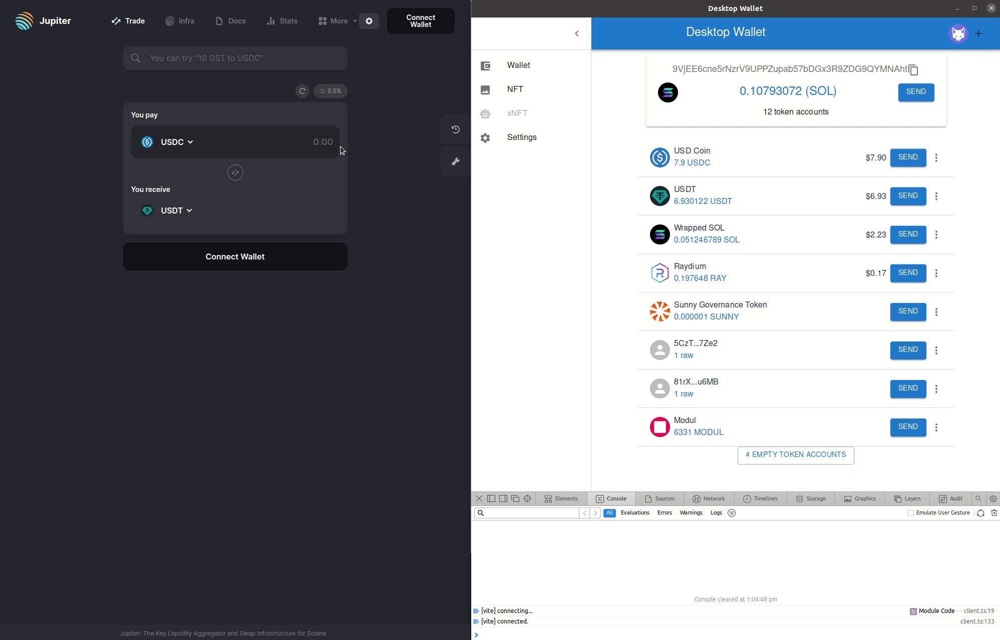

# Desktop wallet

Inspired by Sollet, it brings a slim layer of code to allow to perform basic wallet tasks on Solana

:warning: Do not use for production, under development

The gateaway to a decentralized system cannot be a centralized tool

Goals
- Open source
- 0 tracking, 0 remote logging
- Designed for desktop rather than being mobile first and desktop never
- Trivially customizable
- Connect to any dApp through [Nightly connect](https://connect.nightly.app/docs/client/client/connect/)
- Light but secure

Usage/Setup

https://tauri.app/v1/guides/getting-started/prerequisites/

`yarn install`

`yarn tauri dev`

Create a config folder `~/.config/desktop-wallet/` and add a `keypair.json`
The app only has access to that application folder as per tauri.conf.json

MVP
- Show all user token accounts with logo and amounts
- Order token accounts by USD value, then by mint in base58
- Hide empty token accounts by default to reduce clutter
- Transfer SOL and tokens
- Uses nightly connect to allow usage in any dApp

Future features:
- Identify/fetch NFTs and show them in NFT page
- Allow generation of seed and storage with password encryption
- Address book and easy send between loaded wallets
- RPC switcher with custom RPC settings
- Support hardware wallets
- Settings page to configure it all

Potential advanced features
- Wallet txs activity
- Staking SOL and delegating
- Management of multisig (project-serum?)
- Offline signing
- Desktop a protocol and create a "bridge"
- Implement rust crate to allow signing in the desktop from a CLI request

# Demo

